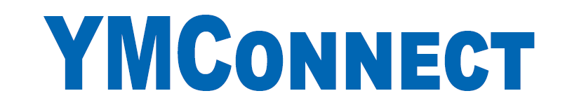

<h1></h1>

YMConnect is a communication library for controlling and monitoring a Yaskawa Motoman robot.

It is compatible with `DX100` and newer controllers. Though many features are only available on the `YRC1000` and newer. 

Documentation is available on the [Motoman Developer Portal](https://developer.motoman.com/en/YMConnect). 

This repository is used for distributing [Releases](https://github.com/Yaskawa-Global/YMConnect/releases).

Please use the [Discussion board](https://github.com/Yaskawa-Global/YMConnect/discussions) for support requests. If the matter is sensitive in nature, techsupport@motoman.com may also be used.
